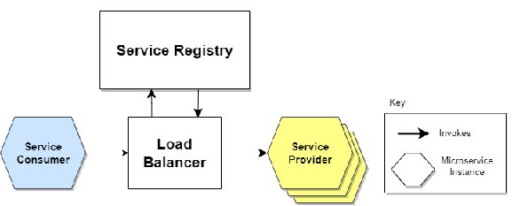

## Tag s1.lb.1.RestTemplate.SimpleDiscoveryClient
RestTemplate load balancing by simple discovery client.

### Spring Cloud
Spring Cloud provides tools for developers to quickly build some of the common patterns in distributed systems.
Spring Cloud is based on Spring Boot, you need ensure the version of Spring Cloud be compatible with the version of Spring Boot.
For example:

| Spring Cloud         | Spring Boot                           |
|----------------------|---------------------------------------|
| 2021.0.x aka Jubilee | 2.6.x, 2.7.x (Starting with 2021.0.3) |
| 2020.0.x aka Ilford  | 2.4.x, 2.5.x (Starting with 2020.0.3) |
| Hoxton               | 2.2.x, 2.3.x (Starting with SR5)      |

To enable Spring Cloud, simply add Spring Cloud dependencies to the project:
```xml
<dependency>
    <groupId>org.springframework.cloud</groupId>
    <artifactId>spring-cloud-dependencies</artifactId>
    <version>${spring.cloud-version}</version>
    <type>pom</type>
    <scope>import</scope>
</dependency>
```
And then adding the starters of the feature you want to the dependencies.

### High Available
High availability is a characteristic of a system which aims to ensure an agreed level of operational performance, usually uptime, for a higher than normal period.
* Elimination of Single Points of Failure (SPOF)
* Reliable crossover
* Detection of failures

Availability is usually expressed as a percentage of uptime in a given year.
* 90%: 36.53 days per year
* 99%: 3.65 days per year
* 99.9%: 8.77 hours per year
* 99.99%: 52.6 minutes per year
* 99.999%: 5.26 minutes per year

To acheive that, multiple instances should be applied for each service, or say cluster is required for each service to improve availability.
As for cluster, load balancing and service discovery are the common features.

### Load Balancing
Load Balancing is the process of distributing **_a set of tasks_** over **_a set of resources_**, with the aim of making their overall processing more efficient.
* Optimize the response time
* Avoid unevenly overloading

The logic about how to distribute tasks is the algorithm of load balancer. Spring Cloud provides Round-Robin, Random two internal algorithm.
We can use @LoadBalancerClient to specify a customized load balancer. See [official document](https://docs.spring.io/spring-cloud-commons/docs/3.1.4/reference/html/#spring-cloud-loadbalancer) for details.
In Spring Cloud, load balancer is bounded with the service invocation clients, such as RestTemplate, Open Feign.

To enable load balancer, adding the following starter:
```xml
<dependency>
    <groupId>org.springframework.cloud</groupId>
    <artifactId>spring-cloud-starter-loadbalancer</artifactId>
</dependency>
```
REST client(RestTemplate, Feign) should not be created manually, they should be injected to Spring container.
That will give Spring opportunity to add load balancer to the client components. 
And the instance should be annotated with @LoadBalanced to let Spring know that you want to enable load balancing.
```java
    @Bean
    @LoadBalanced
    public RestTemplate restTemplate() {
        return new RestTemplate();
    }
```
Load balancer must know all the instances of a service. We can provide a static list of the instances, but the problem is the instances may crash and be replaced by other instances.
So normally microservices achieve this by service discovery.

### Service Discovery
Service discovery is the automatic detection of devices and services offered by these devices on a computer network.
Service registry is normally used as a storage of all active instances of a service. The service needs to provide self registration and heath check features.
* Client-side discovery
  * Client queries service registry to get instance list 
  * Client choose instance based on load balancing algorithm


* Server-side discovery
  * Requests are sent to router or load balancer
  * Router queries a service registry which may be built into router



Spring Cloud supports vendor neutral service discovery solution. To enable it, annotates your main application with @EnableDiscoveryClient.
```java
SpringBootApplication
@EnableDiscoveryClient
public class ScheduleApplication {
    @Bean
    @LoadBalanced
    public RestTemplate restTemplate() {
        return new RestTemplate();
    }
    public static void main(String[] args) {
        SpringApplication.run(ScheduleApplication.class, args);
    }
}
```
@EnableDiscoveryClient makes application look for implementations of the DiscoveryClient, which can be seen as a client of service registry.
Examples of DiscoveryClient implementations include **Spring Cloud Netflix Eureka**, **Spring Cloud Consul Discovery**, and **Spring Cloud Zookeeper Discovery**.

If there is no implementation of DiscoveryClient in the classpath, SimpleDiscoveryClient instance, that uses properties to get information on service and instances, will be used.

#### SimpleDiscoveryClient
If there is no Service-Registry-backed DiscoveryClient in the classpath, SimpleDiscoveryClient instance, that uses properties to get information on service and instances, will be used.
Just adding the instances list to application.yml:
```yaml
spring:
  cloud:
    discovery:
      client:
        simple:
          instances:
            obo-cinema:
              - uri: http://localhost:8081
              - uri: http://localhost:8091
```
The problem is that the list can't be updated when some instances crashed or new instances joined. When this is configured, the instance name should be used in the invocation URL.
For example: http://**obo-cinema**/obo/cinema/%d/hall/%d/seat.

## Try yourself
Follow the instructions to finish the tasks
### Simple Discovery
1. start obo-cinema
2. change the port to 8091, start another instance of obo-cinema. Note: IDEA can't start two instance, execute 'mvn spring-boot:run'.
3. comment or delete the following code(line41-44) in method changeStatus of DefaultScheduleService
```java
        if(preStatus.ordinal()>=status.ordinal()) {
            log.info("schedule status is {}, which can be changed to {}", preStatus, status);
            return schedule;
        }
```
4. start obo-schedule, PUT http://localhost:8084/obo/schedule/test-sched/status/SALE
5. check the log of two obo-cinema instances
6. shutdown one of the obo-cinema instances, invoke change status again and see what happens
7. remove @LoadBalanced in ScheduleApplication, see what happens