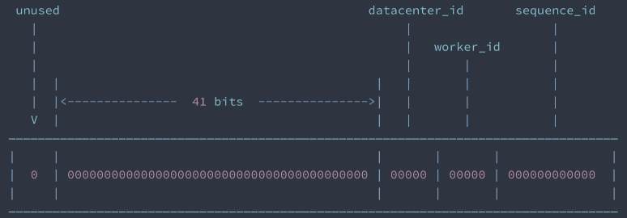

## Tag s3.id.cache
Global service to generate global unique id

### obo-id-center
'[obo-id-center](../obo-id-center)' is a generic service which generates global unique id. Global unique id is important when the database is sharded.
In our case, 'tickets' data were split to distributed databases and tables. A ticket may have same local id with another ticket in another table. 
But for the users, the ticket must be unique. They need a unique ticket number to get their tickets.

There are many algorithms to generate global unique id, like uuid, snowflake and so on. But in our case, the ids generated by those algorithms are too complicated for the users.
We need the ticket number to be as short as possible, and it must only contain numbers. (Because most of the ticket vending machines only provides number keyboard).

When we design 'obo-id-center', we should be aware of the following things:
1. Performance

   A centralized service may probably become the performance bottleneck, because each transaction will send a request to it.
   So we must add some mechanism to improve its performance, or find a way to reduce the amount of the request.

2. Security

   The ticket number SHALL be as random as possible. If there's an easily observed rule for the ticket number, the user may be able to infer the ticket number of others.

At the same time, ticket number has an important feature which may help us to solve above issues. The feature is the timeliness of the ticket number. 
Usually when the ticket is taken, the ticket number can be reused. Even the user didn't take the ticket, it's invalid when the schedule of the movie is done.
So we can give a rough estimation of the total ticket amount, and rotate the number after the number's pool is depleted.

Based on the above analysis, we can give an example design of the service.
1. the length of the number is 16, 8 for random number, 8 for serial number.
   * serial number is generated by obo-id-center
   * random number is generated locally
2. obo-id-center will send a scope of serial number to reduce the request amount.
   * In our case, we set the scope as 1000. That means that 1000 serial number will be sent to the client. The total requests will be reduced to 1/1000. 
   * It's configurable, and can be reduced easily if the amount is still high.
   * If the serial number reach its upper limit, it will be rotated.
3. the serial number and the random number will be shuffled to form the final number.
```java
    public String generatePickupCode() {
        StringBuilder sb = new StringBuilder();
        Long id = nextID();
        int r = random.nextInt(UPPER_BOUND);
        log.debug("id: {}, random: {},", id, r);
        for (int i=0; i<4; i++) {
            sb.append(r%10); r/=10;
            sb.append(r%10); r/=10;
            sb.append(id%10); id/=10;
            sb.append(id%10); id/=10;
        }
        log.debug("generate pickup code: {}", sb);

        return sb.toString();
   }
```

### algorithm
There are some algorithms for global unique id.
#### UUID
UUID is an abbreviation of Universally Unique Identifier. It uses 128 bit, usually represents as 32 hexadecimal digits.
UUID is displayed in five groups separated by hyphens, in the form 8-4-4-4-12 for a total of 36 characters(32 hexadecimal and 4 hyphens).
For example, `550e8400-e29b-41d4-a716-446655440000` is a UUID.
`550e8400-e29b-41d4` is related to time, `a716` is related to sequence, and `446655440000` is related to the machine(MAC address). 
Although UUID is good enough for global unique id, but it has some problem:
* it's too long, may impact the performance and efficiency, especially when there are big amount of data.
* it's not sequential, not easy to build index.
* it contains MAC information, which may be a security risk.

#### snowflake
Snowflake is an algorithm initiated by Twitter to generate unique id. It uses 64 bit, but only 63 bits used to fit signed integer.
The first 41 bits are a timestamp, representing milliseconds since the epoch of computer. The next 10 represents a machine(For example, 5 for datacenter, and 5 for worker node).
The last 12 bits is sequential number to allow generating id at the same milliseconds.



Compared with UUID, snowflake can generate unique id within a certain group of machine, while UUID ensures the ID is unique world-wide.
* 32(2<sup>5</sup>) datacenters and 32(2<sup>5</sup>) workers in each datacenter.(or 1024(2<sup>10</sup>) nodes)
* at most 4096(2<sup>12</sup>) ids at a same millisecond on each worker
* can be used for 69 years(41 bits for time)
Although there's some limitation, it's enough for most of the business case.

### Spring Test
Spring Boot provides a number of utilities and annotations to help when testing your application. 
In our case, we added a unit test for obo-id-center, see [TestIDCenter](../obo-trade/src/test/java/com/github/budwing/obo/trade/TestIDCenter.java) for details.

1. add `spring-boot-starter-test` as a starter of Spring Test
```xml
        <dependency>
            <groupId>org.springframework.boot</groupId>
            <artifactId>spring-boot-starter-test</artifactId>
            <scope>test</scope>
        </dependency>
```
Sprint Test uses JUnit 5, we need add JUnit 5’s vintage engine to run JUnit 4 tests. To use the vintage engine, add a dependency on junit-vintage-engine:
```xml
        <dependency>
            <groupId>org.junit.vintage</groupId>
            <artifactId>junit-vintage-engine</artifactId>
            <scope>test</scope>
            <exclusions>
                <exclusion>
                    <groupId>org.hamcrest</groupId>
                    <artifactId>hamcrest-core</artifactId>
                </exclusion>
            </exclusions>
        </dependency>
```
2. annotate the test class with @SpringBootTest

   This annotation is help the class to load Spring context. If JUnit 4 is used, @RunWith(SpringRunner.class) is also required. 
   Otherwise, the @SpringBootTest will be ignored.
```java
@RunWith(SpringRunner.class)
@SpringBootTest
@Slf4j
public class TestIDCenter {
    private IDScope idScope;
    @Autowired
    private IDCenterClient idCenterClient;

    @Test
    @Repeat(20)
    public void testID() {
        log.debug("test id center");

        if (idScope==null || idScope.needRefresh()) {
            log.debug("refresh id scope {}", idScope);
            idScope = idCenterClient.getNext(1);
        }
        log.debug("next pickup code {}", idScope.generatePickupCode());
    }
}
```
Spring Test won't start a server, but it will initialize the context. 

More information about Spring Test can be found [here](https://docs.spring.io/spring-boot/docs/current/reference/html/features.html#features.testing).

## Try yourself
Follow the instructions to finish the tasks
### Test ID Center
1. start obo-eureka, obo-id-center
2. GET http://localhost:8086/obo/id/1, check the result
### Run UT in obo-trade
1. start mysqld, ShardingSphere Proxy, obo-seata, zookeeper, kafka
2. run unit test in com.github.budwing.obo.trade.TestIDCenter.testID
3. check the output of ID, login mysql database, check id center database status
### Finish whole flow
1. start obo-trade, obo-payment
2. PUT http://localhost:8085/obo/order/1/test-order-id/13999999999/payment
3. copy the payment order id
4. PUT http://localhost:8083/obo/payment/3906b2c3-b6ec-462e-9bc8-3962847e842a/status/SUCCESSFUL
5. login database, check tradedb's obo_order_1, see the pickup_code and status