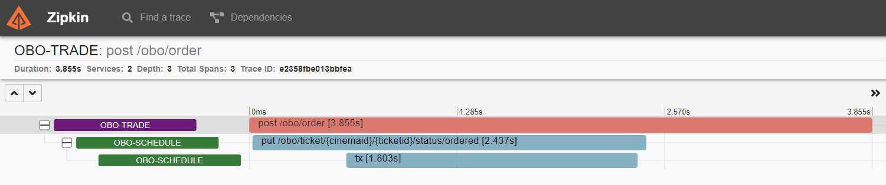

## Tag s4.ob.traces.Zipkin
Enable Spring Cloud Sleuth for tracing

### Tracing
Distributed tracing, also called distributed request tracing, is a method used to profile and monitor applications, especially those built using a microservices architecture. 
Distributed tracing helps pinpoint where failures occur and what causes poor performance. There are some basic concepts in tracing:
* Trace

  A distributed trace is a set of events, triggered as a result of a single logical operation, consolidated across various components of an application. A distributed trace contains events that cross process, network and security boundaries. A distributed trace may be initiated when someone presses a button to start an action on a website - in this example, the trace will represent calls made between the downstream services that handled the chain of requests initiated by this button being pressed.
* Span

  A span represents an operation within a transaction. Each Span encapsulates the following state:
  - An operation name
  - A start and finish timestamp
  - Attributes: A list of key-value pairs.
  - A set of zero or more Events, each of which is itself a tuple (timestamp, name, Attributes). The name must be strings.
  - Parent’s Span identifier.
  - Links to zero or more causally-related Spans (via the SpanContext of those related Spans).
  - SpanContext information required to reference a Span.
```text
Causal relationships between Spans in a single Trace

        [Span A]  ←←←(the root span)
            |
     +------+------+
     |             |
 [Span B]      [Span C] ←←←(Span C is a `child` of Span A)
     |             |
 [Span D]      +---+-------+
               |           |
           [Span E]    [Span F]
```
* SpanContext

  Represents all the information that identifies Span in the Trace and MUST be propagated to child Spans and across process boundaries. A SpanContext contains the tracing identifiers and the options that are propagated from parent to child Spans.

### Zipkin and Brave
[Zipkin](https://zipkin.io/) is a distributed tracing system. It helps gather timing data needed to troubleshoot latency problems in service architectures. Features include both the collection and lookup of this data.
1. download Zipkin from [here](https://search.maven.org/remote_content?g=io.zipkin&a=zipkin-server&v=LATEST&c=exec).
2. run it via the following command:
```shell
java -jar zipkin.jar
```
3. access its UI via `http://localhost:9411/`

While Zipkin is the server side of tracing data, [Brave](https://github.com/openzipkin/brave) is a distributed tracing instrumentation library to intercepts requests and gather timing data, correlate and propagate trace contexts. 
While typically trace data is sent to Zipkin server, third-party plugins are available to send to alternate services such as Amazon X-Ray.

### Spring Cloud Sleuth
[Spring Cloud Sleuth](https://docs.spring.io/spring-cloud-sleuth/docs/current/reference/html/) provides API for distributed tracing solution for Spring Cloud. 
It integrates with OpenZipkin Brave and simplifies the programming of Brave. 

1. add Spring Cloud Sleuth starter
```xml
        <dependency>
            <groupId>org.springframework.cloud</groupId>
            <artifactId>spring-cloud-starter-sleuth</artifactId>
        </dependency>
```
2. use Slf4j to print some log, trace id and span id will be added to each line of log
```text
2022-10-24 18:28:12.227 DEBUG [obo-trade,e2358fbe013bbfea,e2358fbe013bbfea] 27296 --- [io-8085-exec-10] c.g.b.o.t.m.OrderMapper.insertOrder      : ==>  Preparing: insert into obo_order(id, cinema_id, phone, create_time, total_price, status) values(?, ?, ?, ?, ?, ?)
2022-10-24 18:28:12.651 DEBUG [obo-trade,e2358fbe013bbfea,e2358fbe013bbfea] 27296 --- [io-8085-exec-10] c.g.b.o.t.m.OrderMapper.insertOrder      : ==> Parameters: ff9d7b30-54e0-47f2-854f-955daca9fd69(String), 1(Integer), 13999999999(String), 2022-10-24T18:28:12.129(LocalDateTime), 40(Long), 0(Integer)
2022-10-24 18:28:12.797  WARN [obo-trade,e2358fbe013bbfea,e2358fbe013bbfea] 27296 --- [io-8085-exec-10] ServiceLoader$InnerEnhancedServiceLoader : Load [io.seata.rm.datasource.undo.parser.ProtostuffUndoLogParser] class fail. io/protostuff/runtime/IdStrategy
2022-10-24 18:28:12.996 DEBUG [obo-trade,e2358fbe013bbfea,e2358fbe013bbfea] 27296 --- [io-8085-exec-10] c.g.b.o.t.m.OrderMapper.insertOrder      : <==    Updates: 1
2022-10-24 18:28:12.999 DEBUG [obo-trade,e2358fbe013bbfea,e2358fbe013bbfea] 27296 --- [io-8085-exec-10] c.g.b.o.t.m.OrderMapper.insertOrderItem  : ==>  Preparing: insert into obo_order_item(id, cinema_id, price, ticket_id, seat_row, seat_col, seat_floor, order_id) values(?, ?, ?, ?, ?, ?, ?, ?)
2022-10-24 18:28:13.056 DEBUG [obo-trade,e2358fbe013bbfea,e2358fbe013bbfea] 27296 --- [io-8085-exec-10] c.g.b.o.t.m.OrderMapper.insertOrderItem  : ==> Parameters: 22301395-5364-4102-a613-1de5a1f6ae43(String), 1(Integer), 40(Integer), test-ticket-id(String), 1(Integer), 1(Integer), 1(Integer), ff9d7b30-54e0-47f2-854f-955daca9fd69(String)
2022-10-24 18:28:13.159 DEBUG [obo-trade,e2358fbe013bbfea,e2358fbe013bbfea] 27296 --- [io-8085-exec-10] c.g.b.o.t.m.OrderMapper.insertOrderItem  : <==    Updates: 1
```
'[obo-trade,e2358fbe013bbfea,e2358fbe013bbfea]' includes the service name, trace id and span id. The trace information can be used to correlate logs in different services. 
For example, 'obo-schedule' will also print same format log if Sleuth is enabled.
```text
2022-10-24 18:28:10.347 DEBUG [obo-schedule,e2358fbe013bbfea,ed6c9df1d73fc407] 616 --- [nio-8084-exec-8] c.g.b.o.s.s.i.FeignBasedTicketService    : Transaction xid:192.168.0.104:8091:1207284885034532866
2022-10-24 18:28:10.347 DEBUG [obo-schedule,e2358fbe013bbfea,ed6c9df1d73fc407] 616 --- [nio-8084-exec-8] c.g.b.o.s.s.i.FeignBasedTicketService    : Query ticket for id test-ticket-id
2022-10-24 18:28:10.405 DEBUG [obo-schedule,e2358fbe013bbfea,ed6c9df1d73fc407] 616 --- [nio-8084-exec-8] c.g.b.o.s.m.TicketMapper.selectById      : ==>  Preparing: select * from obo_ticket where id = ? and cinema_id = ?
2022-10-24 18:28:10.721 DEBUG [obo-schedule,e2358fbe013bbfea,ed6c9df1d73fc407] 616 --- [nio-8084-exec-8] c.g.b.o.s.m.TicketMapper.selectById      : ==> Parameters: test-ticket-id(String), 1(Integer)
2022-10-24 18:28:11.137 DEBUG [obo-schedule,e2358fbe013bbfea,ed6c9df1d73fc407] 616 --- [nio-8084-exec-8] c.g.b.o.s.m.TicketMapper.selectById      : <==      Total: 1
2022-10-24 18:28:11.141 DEBUG [obo-schedule,e2358fbe013bbfea,ed6c9df1d73fc407] 616 --- [nio-8084-exec-8] c.g.b.o.s.m.T.updateTicketStatus         : ==>  Preparing: update obo_ticket set status=? where id=? and cinema_id=?
2022-10-24 18:28:11.153 DEBUG [obo-schedule,e2358fbe013bbfea,ed6c9df1d73fc407] 616 --- [nio-8084-exec-8] c.g.b.o.s.m.T.updateTicketStatus         : ==> Parameters: 2(Integer), test-ticket-id(String), 1(Integer)
2022-10-24 18:28:11.730 DEBUG [obo-schedule,e2358fbe013bbfea,ed6c9df1d73fc407] 616 --- [nio-8084-exec-8] c.g.b.o.s.m.T.updateTicketStatus         : <==    Updates: 1
```
'[obo-schedule,e2358fbe013bbfea,ed6c9df1d73fc407]' is similar with 'obo-trade'. The trace id is the same, but the service name and span id are different.
That means they are different services, but they belong to a same trace.

3. add Zipkin dependency to let Spring send tracing data to Zipkin
```xml
        <dependency>
            <groupId>org.springframework.cloud</groupId>
            <artifactId>spring-cloud-sleuth-zipkin</artifactId>
        </dependency>
```
If this dependency is not added, Sleuth only add trace information in log.

4. configure sampling rate and the address of Zipkin
```yaml
spring:
  sleuth:
    sampler:
      probability: 1
  zipkin.baseUrl: http://localhost:9411/
```

5. query trace from Zipkin UI

   For example, the preceding example's trace id is 'e2358fbe013bbfea'. We can use this id to find out its whole trace information.



## Try yourself
Follow the instructions to finish the tasks
### Trace of trade
1. download Zipkin from [here](https://search.maven.org/remote_content?g=io.zipkin&a=zipkin-server&v=LATEST&c=exec).
2. run it via the following command:
```shell
java -jar zipkin.jar
```
3. access its UI via `http://localhost:9411/`
4. start mysqld, ShardingSphere Proxy, Zookeeper, Kafka, obo-eureka, obo-seata
5. start obo-trade, obo-schedule, obo-payment, see the changes in log
6. POST http://localhost:8085/obo/order, see the trace pages in Zipkin
7. PUT http://localhost:8085/obo/order/1/23dbec49-feb6-4ca9-be99-60b57dfb677a/1/payment
8. PUT http://localhost:8083/obo/payment/0d7c8c5c-c2b4-4653-8771-b6fc402bbe45/status/SUCCESSFUL
9. check the traces of payments in Zipkin
